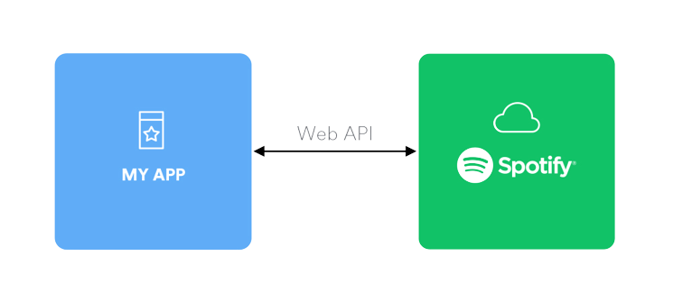

<div id="top"></div>
<br />
<div align="center">
  <a href="https://github.com/Biplo12/spotify-web-api-node">
    
  </a>

<h3 align="center">spotify-web-api-node</h3>

  <p align="center">
    API for Music app using spotify-web-api-node library
    <br />
    <a href="https://github.com/thelinmichael/spotify-web-api-node"><strong>spotify-web-api-node github »</strong></a>
    <br />
  </p>
</div>

<!-- ABOUT THE PROJECT -->

## About The Project

Api based on spotify web api node repo. Includes working access token and refresh token. Can be used to split with UI design.

### Built With

- [React.js](https://reactjs.org/)
- [Express](https://expressjs.com/)
- [Node](https://nodejs.org/en/)

<!-- GETTING STARTED -->

### Installation

1. Get a free API Key at [https://developer.spotify.com/](https://developer.spotify.com/)
2. Clone the repo
   ```sh
   git clone https://github.com/Biplo12/spotify-web-api-node.git
   ```
3. Install NPM packages
   ```sh
   npm install
   ```
4. Create `.env` file and enter your [PORT, REDIRECTED_URI, CLIENT_ID, SECRET_ID]
   ```sh
   For example: `3001`, `http://localhost`, `c0ea526b78745a9009746d6981`, `47f9d224e6ca3478ff137b0b47f9d224`
   ```
5. Run server side with `npm run devStart`

6. Run client side with `npm start`

<!-- USAGE EXAMPLES -->

## Usage

API can be used in project which assumes a summary of the web application connected to the spotify api.

_For more examples, please refer to the [Documentation](https://github.com/thelinmichael/spotify-web-api-node)_

<!-- ROADMAP -->

## Roadmap

- [x] Access token
- [x] Refresh token

<!-- CONTRIBUTING -->

## Contributing

Contributions are what make the open source community such an amazing place to learn, inspire, and create. Any contributions you make are **greatly appreciated**.

If you have a suggestion that would make this better, please fork the repo and create a pull request. You can also simply open an issue with the tag "enhancement".
Don't forget to give the project a star! Thanks again!

1. Fork the Project
2. Create your Feature Branch (`git checkout -b feature/AmazingFeature`)
3. Commit your Changes (`git commit -m 'Add some AmazingFeature'`)
4. Push to the Branch (`git push origin feature/AmazingFeature`)
5. Open a Pull Request

Readme template used: https://github.com/othneildrew/Best-README-Template
